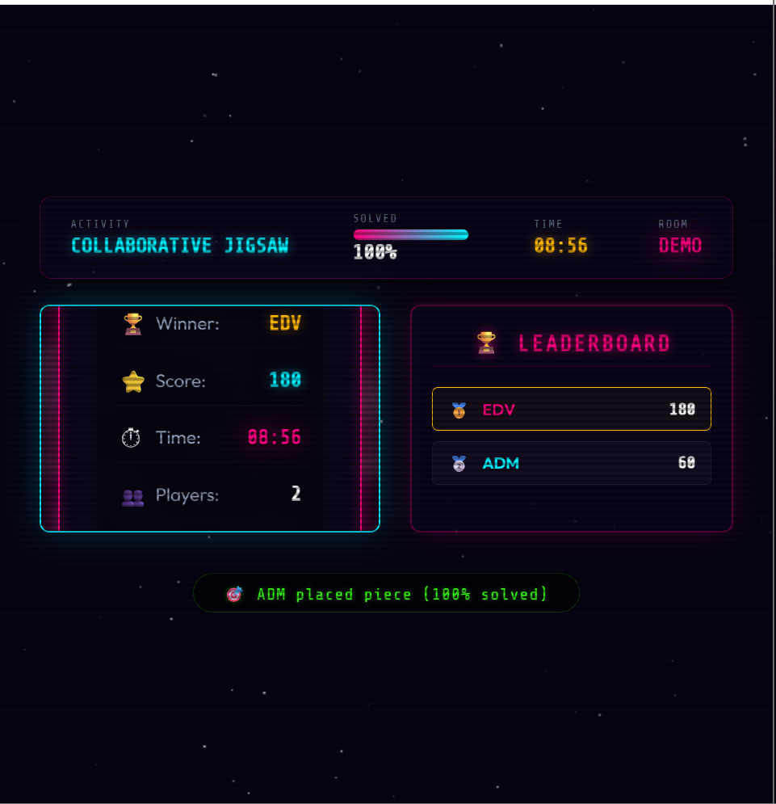
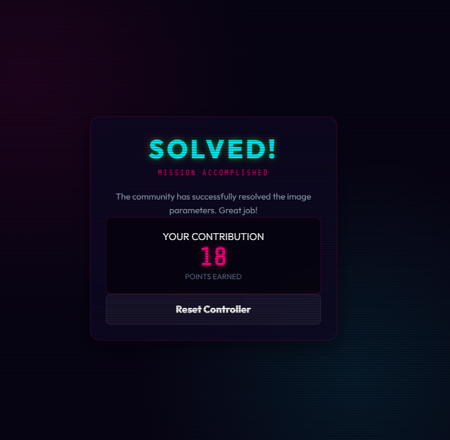
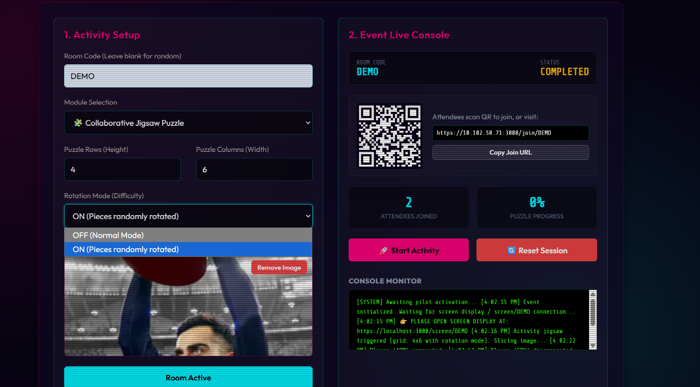

# CrowdPlay Enhanced

A modified version of **CrowdPlay**, a real-time multiplayer collaborative jigsaw puzzle game built with Node.js, Express, and Socket.io. This enhanced version introduces competitive gameplay elements and increased puzzle difficulty while preserving the original multiplayer experience.

## Overview

CrowdPlay allows multiple players to collaborate on a shared jigsaw puzzle using their mobile devices while a large shared screen displays the puzzle board in real time.

This enhanced version adds new gameplay mechanics and competitive elements to improve player engagement and replayability.

---

## ✨ Features Added

### 🏆 Real-Time Leaderboard

A live leaderboard has been integrated into the game to encourage friendly competition among players.

#### Functionality
- Players earn points for correctly placing puzzle pieces.
- Scores update automatically during gameplay.
- Rankings are displayed in real time.
- Leaderboard updates are synchronized across all connected clients.
- Winner determination is based on leaderboard rankings.

#### Benefits
- Encourages competition among participants.
- Makes multiplayer sessions more engaging.
- Provides instant performance feedback.

---

### 🔄 Rotation Mode

An optional puzzle rotation system has been introduced to increase game difficulty.

#### Functionality
- Puzzle pieces may be randomly rotated before assignment.
- Players must rotate pieces to the correct orientation before placing them.
- Rotation state is synchronized in real time across all connected clients.
- Correct placement requires both:
  - Correct position
  - Correct orientation

#### Benefits
- Adds strategic depth to gameplay.
- Creates a more challenging puzzle-solving experience.
- Improves replayability.

---

## 🎮 Original Game Features

- Real-time multiplayer gameplay using Socket.io
- Mobile controller interface for players
- Shared big-screen puzzle display
- QR code-based joining system
- Dynamic image upload and puzzle generation
- Configurable puzzle dimensions
- Automatic puzzle piece assignment
- Real-time puzzle progress tracking

---

## 🚀 Installation

### 1. Clone the Repository

```bash
git clone <your-fork-url>
cd CrowdGame
```

### 2. Install Dependencies

```bash
npm install
```

### 3. Start the Development Server

```bash
npm run dev
```

### 4. Access the Application

#### Admin Dashboard

```text
https://localhost:3000/admin
```

Default Password:

```text
admin123
```

#### Big Screen View

```text
https://localhost:3000/screen/DEMO
```

#### Player View

```text
https://localhost:3000/join/DEMO
```

---

## 🛠 Technology Stack

### Backend
- Node.js
- Express.js
- Socket.io

### Database
- SQLite (Development)
- PostgreSQL (Optional Production Support)

### Storage & Processing
- Sharp (Image Processing)
- Redis (Optional)
- AWS S3 (Optional)

### Frontend
- HTML
- CSS
- JavaScript

---

## 📸 Screenshots

| Admin Dashboard | Real-Time Leaderboard |
|----------------|----------------------|
|  |  |

| Rotation Mode |
|--------------|
|  |


## 🎯 How to Play

1. Open the Admin Dashboard.
2. Upload a puzzle image.
3. Configure puzzle rows and columns.
4. Start the activity.
5. Open the Big Screen view.
6. Players join using the room code or QR code.
7. Players receive puzzle pieces on their mobile devices.
8. Place pieces correctly to earn points.
9. Use rotation controls (if Rotation Mode is enabled).
10. Complete the puzzle and compete for the highest score.

---

## ⚠️ Assumptions & Limitations

- Development mode uses self-signed HTTPS certificates.
- Rotation Mode supports 90° increments:
  - 0°
  - 90°
  - 180°
  - 270°
- Leaderboard data is maintained for the active session.
- SQLite is used by default during development.

---


## 👨‍💻 Author

**Mohammad Jannishar**  
B.Tech CSE, Jamia Millia Islamia

---

